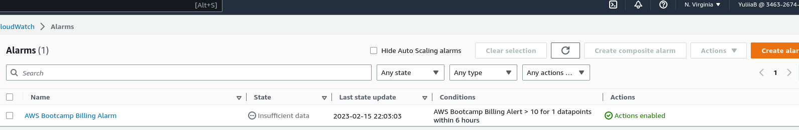

# Week 0 — Billing and Architecture
## Required Homework/Tasks

### Installing AWS CLI
I successfully installed the AWS CLI and made edits to the YAML file. However, I encountered some issues during the commit process. When opening the new workspace in Gitpod, I can verify my AWS credentials, but the AWS CLI commands are not auto-completing as expected. Additionally, the YAML file in Gitpod still displays an exclamation mark, indicating that there may be unresolved issues.

### Recreated Conceptual Diagram

(https://lucid.app/lucidchart/c27f19a3-930b-4c5b-b0bb-93898f1e29f3/edit?viewport_loc=-142%2C-108%2C3328%2C1582%2C0_0&invitationId=inv_4137ba08-8b39-4510-958e-4748cf919a4d)

### Recreated Logical Architectural Diagram

https://lucid.app/lucidchart/f7331734-2cd1-4649-8cb8-9b7ce4fb80fc/edit?viewport_loc=-357%2C127%2C2515%2C1196%2C0_0&invitationId=inv_bd32fcc5-0f2f-47a3-8ef0-760c5e2651f8

### Created a Billing Alarm

### Created a Budget

