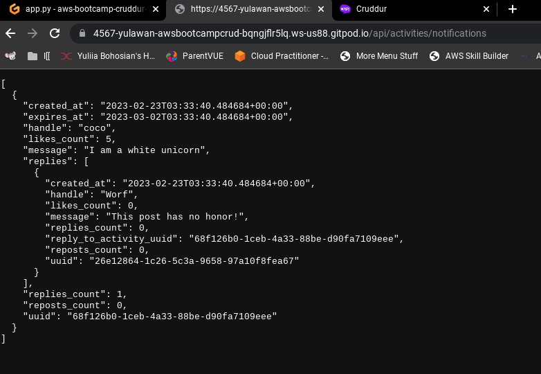
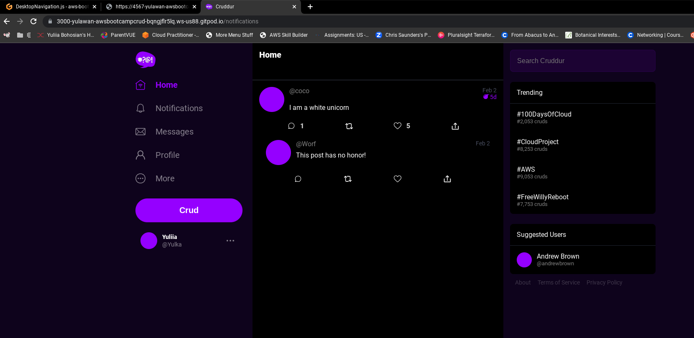
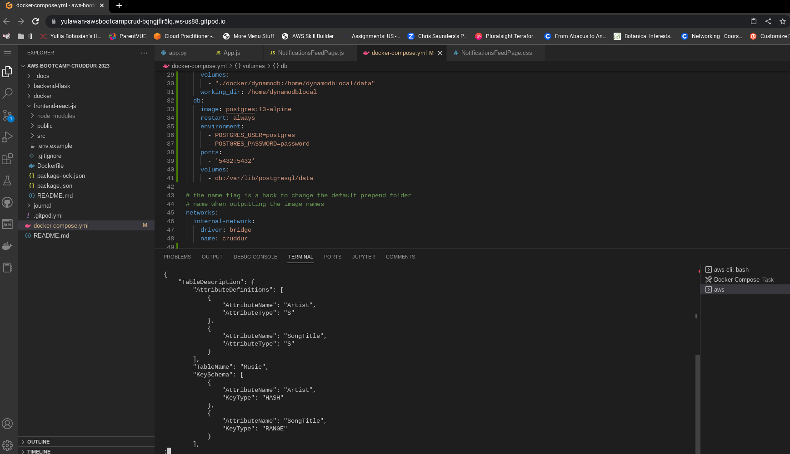

# Week 1 — App Containerization
## Required Homework

### Containerize Application (Dockerfile, DockerCompose)

### Notification Endpoint Implementation
#### Backend

#### Frontend

### DynamoDb Container

### Fixed Git push isssue
    

