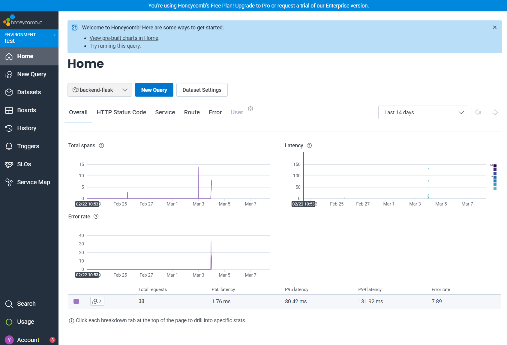
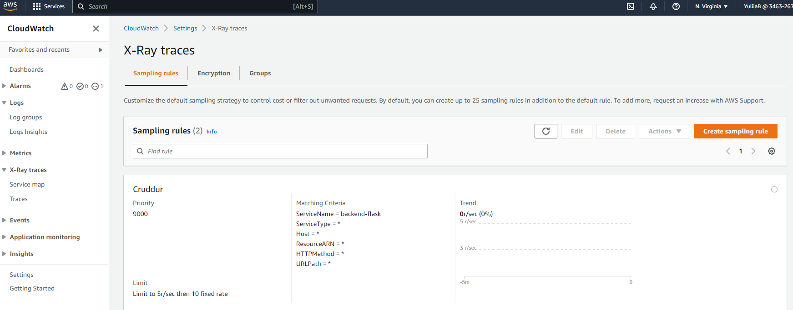
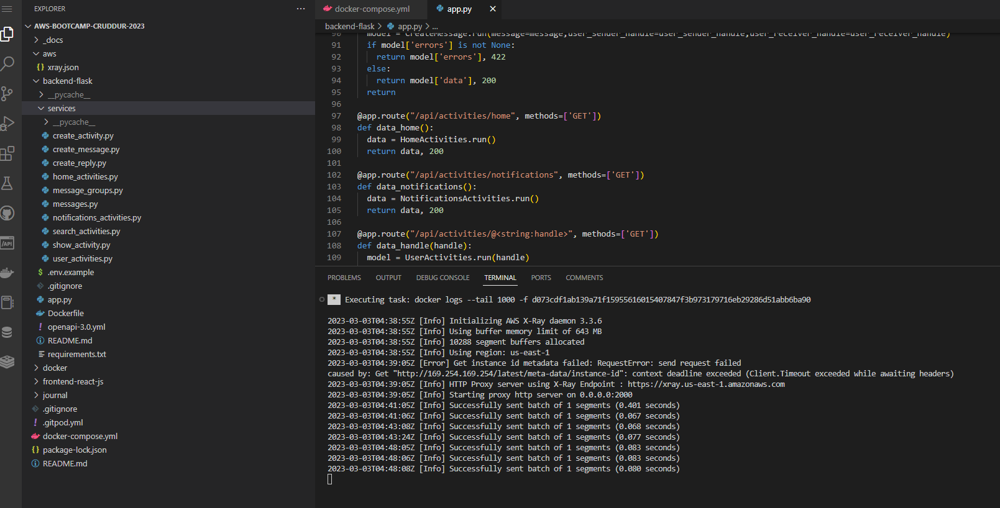
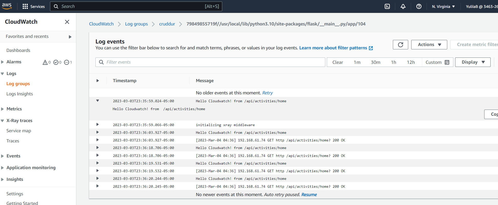
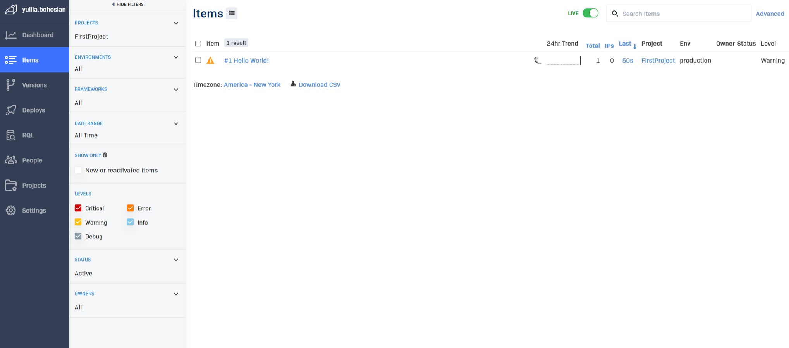

# Week 2 — Distributed Tracing

## Required Homework
### Instrument Honeycomb with OTEL
#### Getting result of traces on Honeycomb

### AWS X-RAY

### Custom CloudWatch Logs
#### Implementing CloudWatch 

#### Receiving Logs

### Integrate Rollbar and capture error
#### Rollbar integration and error capturing

