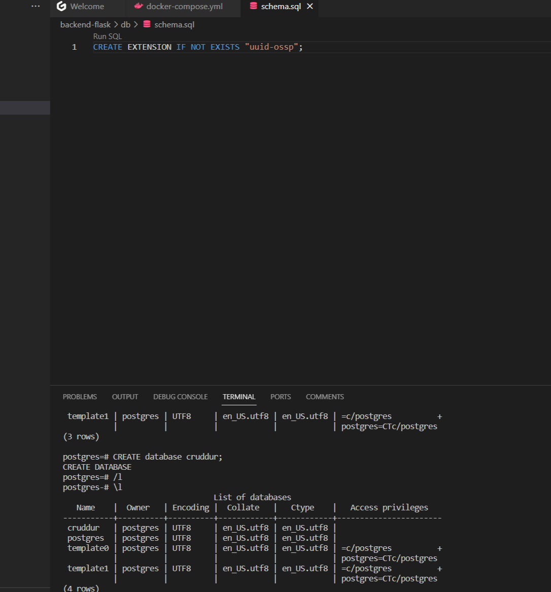
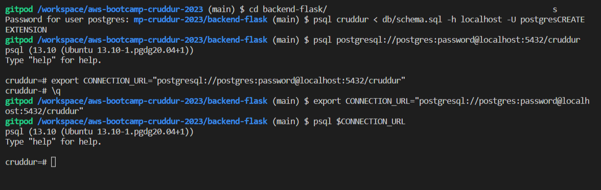
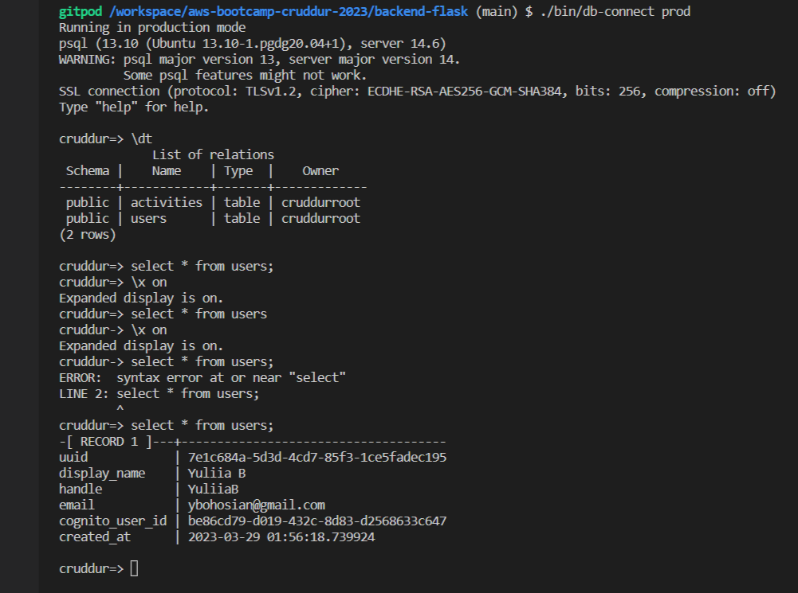
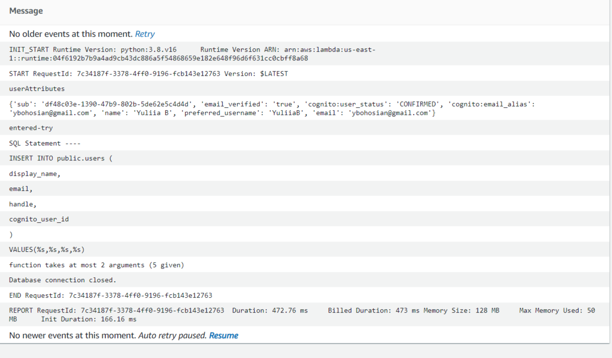
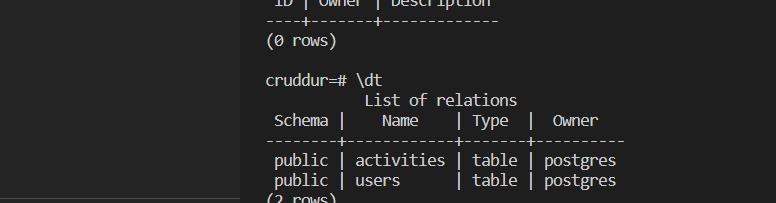
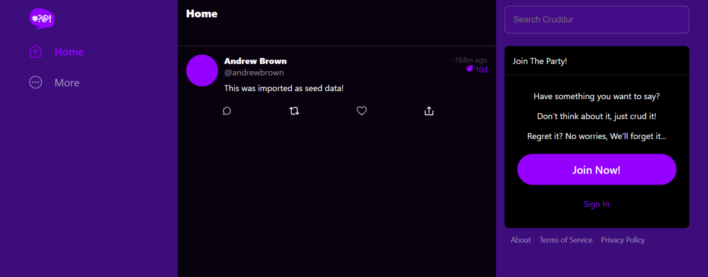

# Week 4 — Postgres and RDS
I was working few weeks on Week4 tasks. I stuck on creating activities with database insert - making CRUD posting. I was getting many errors - first about connection failed - I understood that I was not able to connect to my RDS db in prod mood - I checked the environmental variable for Connection URl and fins what I was missing. The next few errors were about user handle, for now I hardcoded the user_handle as username. And another error was AttributeError: 'Db' object has no attribute 'query_wrap_object'  - turns out I was missing ccorrect indentation for the last two functions and they were out of the object. After fixing that I finally was able to get CruDs posted.
#### CRUD posting is working

#### Ensuring DB has activities filled

#### Creating DB

#### Establishing connefction to local DB

#### Getting User data in db 

